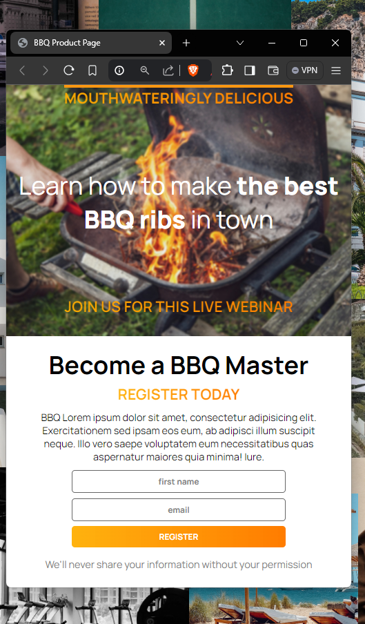
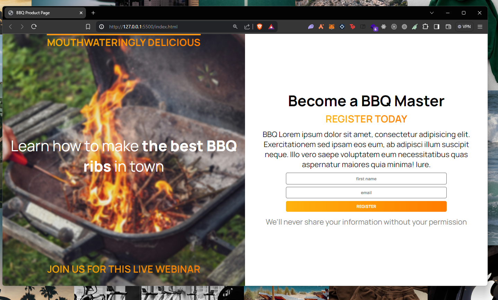
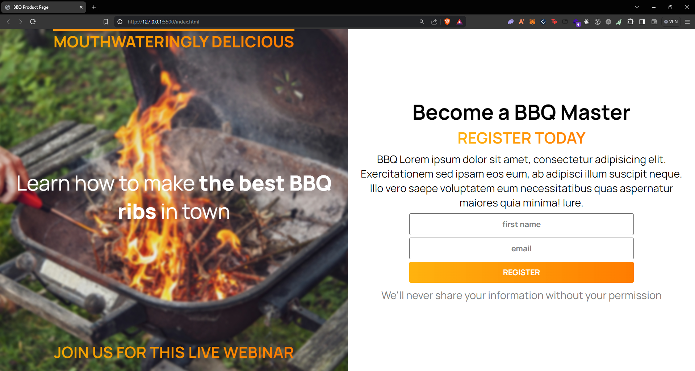

# BBQ Product Page

This project is a responsive BBQ product page created as part of an assignment for a Scrimba course. The page promotes a live webinar on how to make the best BBQ ribs and encourages visitors to register for the event.

## Screenshots

### Mobile View


### Laptop View


### Desktop View


## Features

- **Responsive Design**: The page is designed to look great on devices of various screen sizes, including mobile, tablet, and desktop.
- **Modern Layout**: Utilizes flexbox for layout management and media queries for responsive design.
- **Stylish Typography**: Includes custom fonts and text styles to enhance visual appeal.
- **Interactive Form**: A registration form that allows users to sign up for the webinar.

## Technologies Used

- HTML
- CSS (with media queries for responsiveness)
- Google Fonts (Manrope)

## Structure

### HTML

The HTML file includes two main sections:

1. **Introduction Section**: A brief introduction with a background image, an engaging heading, and a call-to-action to join the webinar.
2. **Registration Section**: Detailed information about the webinar and a form for users to register.

### CSS

The CSS file includes styles for:

- **Typography**: Custom fonts and gradient text effects.
- **Layout**: Flexbox layout for alignment and spacing.
- **Responsive Design**: Media queries for adjusting styles based on screen width.

## Setup and Usage

1. **Clone the repository**:
    ```sh
    git clone https://github.com/lambersonistaken/bbq-product-page.git
    ```

2. **Navigate to the project directory**:
    ```sh
    cd bbq-product-page
    ```

3. **Open `index.html` in your web browser** to view the project.

## License

This project is licensed under the MIT License. See the [LICENSE](./LICENSE) file for more information.

## Acknowledgements

- This project was developed as part of a Scrimba course assignment.
- Background image from Unsplash.
